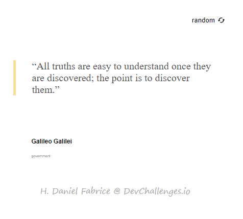

# Random Quote Generator in React

<h1 align="center">Random quote Generator</h1>

<div align="center">
  <h3>
    <a href="https://{your-demo-link.your-domain}">
      Demo
    </a>
    <span> | </span>
    <a href="https://{your-url-to-the-solution}">
      Solution
    </a>
  </h3>
</div>

<!-- TABLE OF CONTENTS -->

## Table of Contents

-   [Overview](#overview)
    -  [Built With](https://reactjs.org/)
-   [Features](#features)
-   [How to use](#how-to-use)
-   [Contact](#contact)
-   [Acknowledgements](#acknowledgements)

<!-- OVERVIEW -->

## Overview



Introduce your projects by taking a screenshot or a gif. Try to tell visitors a story about your project by answering:

-   Feel free to visit my demo on [Netlify](https://affectionate-shaw-8dcd34.netlify.app/)
-   During the time I created this app, I was struggled with dealing with router.
-   What I have learned was, when using router, the main page should be after all pages. 

### Built With
-   [React](https://reactjs.org/)

## Features
- [Quote Guarden](https://pprathameshmore.github.io/QuoteGarden/)
- [icons](https://google.github.io/material-design-icons/)


## How To Use

To clone and run this application, you'll need [Git](https://git-scm.com) and [Node.js](https://nodejs.org/en/download/) (which comes with [npm](http://npmjs.com)) installed on your computer. From your command line:

```bash
# Clone this repository
$ git clone https://github.com/your-user-name/your-project-name

# Install dependencies
$ npm install

# Run the app
$ npm start
```

## Contact

-   Website [React Random Quote generator](https://affectionate-shaw-8dcd34.netlify.app/)
-   GitHub [voromahery](https://github.com/voromahery/react-random-quote-generator)
